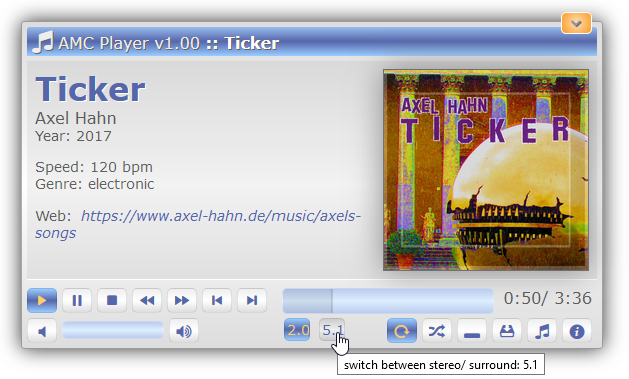
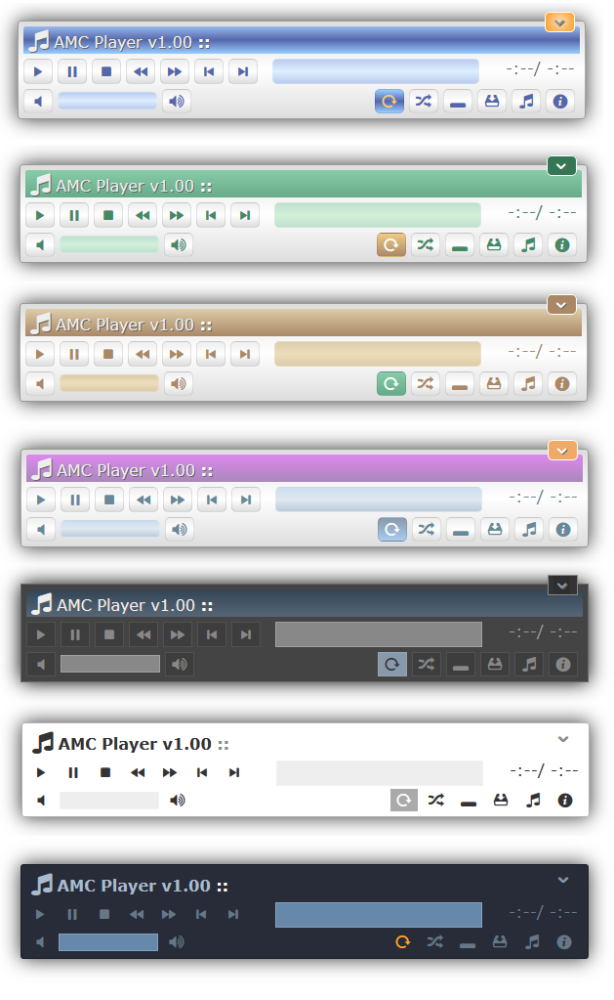

# AMC Player

## Description 

AMC player is a web based html5 audio player.
There are tons of html5 players around. The focus of this one is the handling of audio media in stereo ... and 5.1 surround of a song and switch between them. But it works with stereo only audios too.

🌐 project home: <https://github.com/axelhahn/amcplayer/> \
📖 docs: <https://www.axel-hahn.de/docs/amcplayer/index.htm> ... or see ./example/example1.html \
📜 licence: GNU GPL

## Features 

It is pure javascript and independent from any javascript framework.

* API access
* skins
* multi language support
* plays 
  * mp3+ogg files in stereo
  * ogg+mp4 file in 5.1 surround
  * radio streams (http streams with mp3 or aac)
* examples are included in the download

## Screenshots 

### Main window

With adding metadate to a song it can look like this:

### Skins

A few skins are included:

